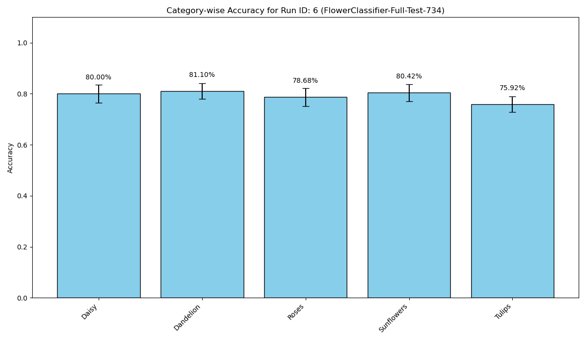

# VISION MODEL BRANCH RECAP

So after getting the fastapi, database dialed in along with a simple python test and another simple matrix multiplication test of our evaluator, i decided that we need to have an actual ML model to run the platform against.  I know there are a couple well-known ml models that come packaged with pytorch/tensorflow or within books...flowers (i think both frameworks have a simple flower id model), there is a rent prediction model ( I think its in Sascke's (?), book 'scikti-learn with pytorch, or something like that).  Anyways i decide to use tensorflow 5 flower id model. Its relatively small (3600ish and 700 ish train/test split), so it wont take all day to train, and its allreay labelled. I'm not really trying to learn how to make a ML model, just test it easily, so we can leave the complex ML/AI models for later.  Find some other foundational model to train on, use llama/chat whatever. We will get there later. Anyways.

## Get the data.

You can download the data set from tensorflow.  I used this little script:
```
mport tensorflow_datasets as tfds
import os

def main():
    """
    Downloads the 'tf_flowers' dataset using TensorFlow Datasets.
    """
    print("--- Downloading 'tf_flowers' dataset ---")
    print("This may take a few minutes...")

    # The data is typically downloaded to ~/tensorflow_datasets/ 
    # We just need to load it once to trigger the download.
    builder = tfds.builder("tf_flowers")
    builder.download_and_prepare()

    download_dir = os.path.join(os.path.expanduser("~"), "tensorflow_datasets")

    print("\n✅ 'tf_flowers' dataset downloaded and prepared successfully.")
    print(f"   Data is located in: {download_dir}")
    print("   You do not need to run this script again.")

if __name__ == "__main__":
    main()
```

Why did I download it to home and not into the repo and just add a line to .gitignore?  Good question. Moving on. (IKNOWIKNOWIKNOW-you jsut script stuff up,and then instead of easily changing something you just ignore it-wait theres more what about your gpu accsss?)
Anyways. It works.  Also make sure you download tf/pytorch etc into the working venv (conda or otherwise)

## Training
i use mobilenetv2 to use as a foundational model and just train it on the 3600ish images.  Its easy, and you dont have to train something from scratch.  We might do that in the future, and see if we can use this to guide ML dev (that is the whole idea).  
So i have a script (scripts/train_imagae_classifeer.py), and it loads the tf_flowers dataset, preprocesses the images (resize and normalize pixel vals), loads a pre-trained MobileNetV2 model,(good at recognizing general features in an image) and fine tune it last layers for flower id.  Train it for a couple (5)epochs, Save as a .keras file, that we can load into our framework. Ok NBD.
```
python scripts/train_image_classifier.py
2025-12-17 12:01:33.619785: I tensorflow/core/util/port.cc:153] oneDNN custom operations are on. You may see slightly different numerical results due to floating-point round-off errors from different computation orders. To turn them off, set the environment variable `TF_ENABLE_ONEDNN_OPTS=0`.
2025-12-17 12:01:33.678671: I tensorflow/core/platform/cpu_feature_guard.cc:210] This TensorFlow binary is optimized to use available CPU instructions in performance-critical operations.
To enable the following instructions: AVX2 AVX_VNNI FMA, in other operations, rebuild TensorFlow with the appropriate compiler flags.
2025-12-17 12:01:35.124950: I tensorflow/core/util/port.cc:153] oneDNN custom operations are on. You may see slightly different numerical results due to floating-point round-off errors from different computation orders. To turn them off, set the environment variable `TF_ENABLE_ONEDNN_OPTS=0`.
--- Starting Image Classifier Training ---
Loading tf_flowers dataset...
WARNING: All log messages before absl::InitializeLog() is called are written to STDERR
W0000 00:00:1766001698.443404  763684 gpu_device.cc:2342] Cannot dlopen some GPU libraries. Please make sure the missing libraries mentioned above are installed properly if you would like to use GPU. Follow the guide at https://www.tensorflow.org/install/gpu for how to download and setup the required libraries for your platform.
Skipping registering GPU devices...
Dataset loaded.
Number of classes: 5
Building model (MobileNetV2 with fine-tuning)...
Downloading data from https://storage.googleapis.com/tensorflow/keras-applications/mobilenet_v2/mobilenet_v2_weights_tf_dim_ordering_tf_kernels_1.0_160_no_top.h5
9406464/9406464 ━━━━━━━━━━━━━━━━━━━━ 1s 0us/step
Compiling model...
Model: "sequential"
┏━━━━━━━━━━━━━━━━━━━━━━━━━━━━━━━━━━━━━━┳━━━━━━━━━━━━━━━━━━━━━━━━━━━━━┳━━━━━━━━━━━━━━━━━┓
┃ Layer (type)                         ┃ Output Shape                ┃         Param # ┃
┡━━━━━━━━━━━━━━━━━━━━━━━━━━━━━━━━━━━━━━╇━━━━━━━━━━━━━━━━━━━━━━━━━━━━━╇━━━━━━━━━━━━━━━━━┩
│ mobilenetv2_1.00_160 (Functional)    │ (None, 5, 5, 1280)          │       2,257,984 │
├──────────────────────────────────────┼─────────────────────────────┼─────────────────┤
│ global_average_pooling2d             │ (None, 1280)                │               0 │
│ (GlobalAveragePooling2D)             │                             │                 │
├──────────────────────────────────────┼─────────────────────────────┼─────────────────┤
│ dense (Dense)                        │ (None, 5)                   │           6,405 │
└──────────────────────────────────────┴─────────────────────────────┴─────────────────┘
 Total params: 2,264,389 (8.64 MB)
 Trainable params: 6,405 (25.02 KB)
 Non-trainable params: 2,257,984 (8.61 MB)
Training model for 5 epochs...
Epoch 1/5
2025-12-17 12:01:43.337661: I tensorflow/core/kernels/data/tf_record_dataset_op.cc:396] The default buffer size is 262144, which is overridden by the user specified `buffer_size` of 8388608
92/92 ━━━━━━━━━━━━━━━━━━━━ 16s 149ms/step - accuracy: 0.2803 - loss: 1.7400 - val_accuracy: 0.4523 - val_loss: 1.3411
Epoch 2/5
92/92 ━━━━━━━━━━━━━━━━━━━━ 13s 139ms/step - accuracy: 0.5606 - loss: 1.1453 - val_accuracy: 0.6621 - val_loss: 0.9773
Epoch 3/5
92/92 ━━━━━━━━━━━━━━━━━━━━ 12s 134ms/step - accuracy: 0.6962 - loss: 0.8788 - val_accuracy: 0.7425 - val_loss: 0.7944
Epoch 4/5
92/92 ━━━━━━━━━━━━━━━━━━━━ 13s 137ms/step - accuracy: 0.7558 - loss: 0.7333 - val_accuracy: 0.7793 - val_loss: 0.6885
Epoch 5/5
92/92 ━━━━━━━━━━━━━━━━━━━━ 13s 137ms/step - accuracy: 0.7875 - loss: 0.6441 - val_accuracy: 0.7916 - val_loss: 0.6172
Training complete.
✅ Trained model saved to: models/cv_flower_classifier.keras


```
### First problem

So the whole thinf failed catastrophically, when i tried to seed the test case db table.  Apparently the data comes down as a TFRecord not a jpg.So we have to coonvert to jpg, make a new local directory data/seeded)images/ and use the paths there to create the TestCAse entries via the API. (get the prompts)
```
python scripts/seed_cv_test_cases.py
--- Seeding Computer Vision TestCases from /home/dell-linux-dev3/tensorflow_datasets/tf_flowers/3.0.1 ---
❌ Error: No category subdirectories found in /home/dell-linux-dev3/tensorflow_datasets/tf_flowers/3.0.1.
```
Ok...fixed that <above>
```
python scripts/seed_cv_test_cases.py
2025-12-17 12:16:39.569450: I tensorflow/core/util/port.cc:153] oneDNN custom operations are on. You may see slightly different numerical results due to floating-point round-off errors from different computation orders. To turn them off, set the environment variable `TF_ENABLE_ONEDNN_OPTS=0`.
2025-12-17 12:16:39.629178: I tensorflow/core/platform/cpu_feature_guard.cc:210] This TensorFlow binary is optimized to use available CPU instructions in performance-critical operations.
To enable the following instructions: AVX2 AVX_VNNI FMA, in other operations, rebuild TensorFlow with the appropriate compiler flags.
2025-12-17 12:16:40.655633: I tensorflow/core/util/port.cc:153] oneDNN custom operations are on. You may see slightly different numerical results due to floating-point round-off errors from different computation orders. To turn them off, set the environment variable `TF_ENABLE_ONEDNN_OPTS=0`.
--- Seeding Computer Vision TestCases by extracting from TFRecords ---
Loading 'tf_flowers' dataset...
WARNING: All log messages before absl::InitializeLog() is called are written to STDERR
W0000 00:00:1766002603.971525  771743 gpu_device.cc:2342] Cannot dlopen some GPU libraries. Please make sure the missing libraries mentioned above are installed properly if you would like to use GPU. Follow the guide at https://www.tensorflow.org/install/gpu for how to download and setup the required libraries for your platform.
Skipping registering GPU devices...
Dataset loaded. Found classes: ['dandelion', 'daisy', 'tulips', 'sunflowers', 'roses']
Collecting 5 images per category...
2025-12-17 12:16:44.115108: I tensorflow/core/kernels/data/tf_record_dataset_op.cc:396] The default buffer size is 262144, which is overridden by the user specified `buffer_size` of 8388608
2025-12-17 12:16:44.714815: I tensorflow/core/framework/local_rendezvous.cc:407] Local rendezvous is aborting with status: OUT_OF_RANGE: End of sequence

Processing category: 'tulips'...

❌ Error: Could not connect to the API at http://localhost:8000/api/v1/prompts/.
Please ensure your FastAPI application (uvicorn) is running.
(ml-eval-framework) dell-linux-dev3@dell-linux-dev3-Precision-3591:~/Projects/ml-evaluation-framework$ python scripts/seed_cv_test_cases.py
2025-12-17 12:17:08.754686: I tensorflow/core/util/port.cc:153] oneDNN custom operations are on. You may see slightly different numerical results due to floating-point round-off errors from different computation orders. To turn them off, set the environment variable `TF_ENABLE_ONEDNN_OPTS=0`.
2025-12-17 12:17:08.814784: I tensorflow/core/platform/cpu_feature_guard.cc:210] This TensorFlow binary is optimized to use available CPU instructions in performance-critical operations.
To enable the following instructions: AVX2 AVX_VNNI FMA, in other operations, rebuild TensorFlow with the appropriate compiler flags.
2025-12-17 12:17:10.118239: I tensorflow/core/util/port.cc:153] oneDNN custom operations are on. You may see slightly different numerical results due to floating-point round-off errors from different computation orders. To turn them off, set the environment variable `TF_ENABLE_ONEDNN_OPTS=0`.
--- Seeding Computer Vision TestCases by extracting from TFRecords ---
Loading 'tf_flowers' dataset...
WARNING: All log messages before absl::InitializeLog() is called are written to STDERR
W0000 00:00:1766002633.556957  772220 gpu_device.cc:2342] Cannot dlopen some GPU libraries. Please make sure the missing libraries mentioned above are installed properly if you would like to use GPU. Follow the guide at https://www.tensorflow.org/install/gpu for how to download and setup the required libraries for your platform.
Skipping registering GPU devices...
Dataset loaded. Found classes: ['dandelion', 'daisy', 'tulips', 'sunflowers', 'roses']
Collecting 5 images per category...
2025-12-17 12:17:13.683050: I tensorflow/core/kernels/data/tf_record_dataset_op.cc:396] The default buffer size is 262144, which is overridden by the user specified `buffer_size` of 8388608
2025-12-17 12:17:14.318772: I tensorflow/core/framework/local_rendezvous.cc:407] Local rendezvous is aborting with status: OUT_OF_RANGE: End of sequence

Processing category: 'tulips'...
  ✅ Successfully created TestCase for: /home/dell-linux-dev3/Projects/ml-evaluation-framework/data/seeded_images/tulips/tulips_1.jpg
  ✅ Successfully created TestCase for: /home/dell-linux-dev3/Projects/ml-evaluation-framework/data/seeded_images/tulips/tulips_2.jpg
  ✅ Successfully created TestCase for: /home/dell-linux-dev3/Projects/ml-evaluation-framework/data/seeded_images/tulips/tulips_3.jpg
  ✅ Successfully created TestCase for: /home/dell-linux-dev3/Projects/ml-evaluation-framework/data/seeded_images/tulips/tulips_4.jpg
  ✅ Successfully created TestCase for: /home/dell-linux-dev3/Projects/ml-evaluation-framework/data/seeded_images/tulips/tulips_5.jpg

Processing category: 'sunflowers'...
  ✅ Successfully created TestCase for: /home/dell-linux-dev3/Projects/ml-evaluation-framework/data/seeded_images/sunflowers/sunflowers_1.jpg
  ✅ Successfully created TestCase for: /home/dell-linux-dev3/Projects/ml-evaluation-framework/data/seeded_images/sunflowers/sunflowers_2.jpg
  ✅ Successfully created TestCase for: /home/dell-linux-dev3/Projects/ml-evaluation-framework/data/seeded_images/sunflowers/sunflowers_3.jpg
  ✅ Successfully created TestCase for: /home/dell-linux-dev3/Projects/ml-evaluation-framework/data/seeded_images/sunflowers/sunflowers_4.jpg
  ✅ Successfully created TestCase for: /home/dell-linux-dev3/Projects/ml-evaluation-framework/data/seeded_images/sunflowers/sunflowers_5.jpg

Processing category: 'roses'...
  ✅ Successfully created TestCase for: /home/dell-linux-dev3/Projects/ml-evaluation-framework/data/seeded_images/roses/roses_1.jpg
  ✅ Successfully created TestCase for: /home/dell-linux-dev3/Projects/ml-evaluation-framework/data/seeded_images/roses/roses_2.jpg
  ✅ Successfully created TestCase for: /home/dell-linux-dev3/Projects/ml-evaluation-framework/data/seeded_images/roses/roses_3.jpg
  ✅ Successfully created TestCase for: /home/dell-linux-dev3/Projects/ml-evaluation-framework/data/seeded_images/roses/roses_4.jpg
  ✅ Successfully created TestCase for: /home/dell-linux-dev3/Projects/ml-evaluation-framework/data/seeded_images/roses/roses_5.jpg

Processing category: 'dandelion'...
  ✅ Successfully created TestCase for: /home/dell-linux-dev3/Projects/ml-evaluation-framework/data/seeded_images/dandelion/dandelion_1.jpg
  ✅ Successfully created TestCase for: /home/dell-linux-dev3/Projects/ml-evaluation-framework/data/seeded_images/dandelion/dandelion_2.jpg
  ✅ Successfully created TestCase for: /home/dell-linux-dev3/Projects/ml-evaluation-framework/data/seeded_images/dandelion/dandelion_3.jpg
  ✅ Successfully created TestCase for: /home/dell-linux-dev3/Projects/ml-evaluation-framework/data/seeded_images/dandelion/dandelion_4.jpg
  ✅ Successfully created TestCase for: /home/dell-linux-dev3/Projects/ml-evaluation-framework/data/seeded_images/dandelion/dandelion_5.jpg

Processing category: 'daisy'...
  ✅ Successfully created TestCase for: /home/dell-linux-dev3/Projects/ml-evaluation-framework/data/seeded_images/daisy/daisy_1.jpg
  ✅ Successfully created TestCase for: /home/dell-linux-dev3/Projects/ml-evaluation-framework/data/seeded_images/daisy/daisy_2.jpg
  ✅ Successfully created TestCase for: /home/dell-linux-dev3/Projects/ml-evaluation-framework/data/seeded_images/daisy/daisy_3.jpg
  ✅ Successfully created TestCase for: /home/dell-linux-dev3/Projects/ml-evaluation-framework/data/seeded_images/daisy/daisy_4.jpg
  ✅ Successfully created TestCase for: /home/dell-linux-dev3/Projects/ml-evaluation-framework/data/seeded_images/daisy/daisy_5.jpg

🎉 Seeding complete. Created 25 new TestCases in 'data/seeded_images'.

```
Here i didnt have the FastApi app running, or maybe the container was down, probalby the former.  Anyways i started that up and then re-ran it with 25 tests.  That seemed fine, but then i remembered we have a test data set of 700ish samples, just do them all. 

After some frogging around (setting limits to 100 samples, why?), I jsut ran it against the entire test dataset.  I also made a report generation script, which gives us some nice outputs and a sweet chart graph.

```
curl -X 'POST'   'http://localhost:8000/api/v1/runs/'   -H 'Content-Type: application/json'   -d '{
    "model_name": "FlowerClassifier-Full-Test-734",
    "model_version": "1.0",
    "model_type": "image_classification"
  }'
{"model_name":"FlowerClassifier-Full-Test-734","model_version":"1.0","model_type":"image_classification","model_endpoint":null,"config":{},"id":6,"status":"pending","started_at":"2025-12-18T19:31:06.712754","completed_at":null,"total_cases":0,"completed_cases":0,"failed_cases":0}(ml-eval-framework) dell-linux-dev3@dell-linux-dev3-Precision-3591:~/Projects/ml-evaluation-framework$ python scripts/run_evaluation.py 6
2025-12-18 11:31:30.886383: I tensorflow/core/util/port.cc:153] oneDNN custom operations are on. You may see slightly different numerical results due to floating-point round-off errors from different computation orders. To turn them off, set the environment variable `TF_ENABLE_ONEDNN_OPTS=0`.
2025-12-18 11:31:30.916528: I tensorflow/core/platform/cpu_feature_guard.cc:210] This TensorFlow binary is optimized to use available CPU instructions in performance-critical operations.
To enable the following instructions: AVX2 AVX_VNNI FMA, in other operations, rebuild TensorFlow with the appropriate compiler flags.
2025-12-18 11:31:31.886528: I tensorflow/core/util/port.cc:153] oneDNN custom operations are on. You may see slightly different numerical results due to floating-point round-off errors from different computation orders. To turn them off, set the environment variable `TF_ENABLE_ONEDNN_OPTS=0`.
--- Setting up evaluation for ModelRun ID: 6 ---
--- Initializing components ---
--- Loading trained flower classifier model... ---
WARNING: All log messages before absl::InitializeLog() is called are written to STDERR
W0000 00:00:1766086294.822696 1194978 gpu_device.cc:2342] Cannot dlopen some GPU libraries. Please make sure the missing libraries mentioned above are installed properly if you would like to use GPU. Follow the guide at https://www.tensorflow.org/install/gpu for how to download and setup the required libraries for your platform.
Skipping registering GPU devices...
✅ Model loaded. Class names: ['dandelion', 'daisy', 'tulips', 'sunflowers', 'roses']
✅ Components initialized for model_type: image_classification.
--- Instantiating Evaluation Engine ---
✅ Engine instantiated.
--- Running evaluation for ModelRun ID: 6 ---
Starting evaluation for ModelRun 6 (FlowerClassifier-Full-Test-734 1.0)...
1/1 ━━━━━━━━━━━━━━━━━━━━ 1s 512ms/step
1/1 ━━━━━━━━━━━━━━━━━━━━ 0s 38ms/step
1/1 ━━━━━━━━━━━━━━━━━━━━ 0s 35ms/step
1/1 ━━━━━━━━━━━━━━━━━━━━ 0s 37ms/step
1/1 ━━━━━━━━━━━━━━━━━━━━ 0s 35ms/step
1/1 ━━━━━━━━━━━━━━━━━━━━ 0s 38ms/step
1/1 ━━━━━━━━━━━━━━━━━━━━ 0s 36ms/step
...thsi goes on for 760somethign times...
...
1/1 ━━━━━━━━━━━━━━━━━━━━ 0s 37ms/step
1/1 ━━━━━━━━━━━━━━━━━━━━ 0s 43ms/step
1/1 ━━━━━━━━━━━━━━━━━━━━ 0s 34ms/step
1/1 ━━━━━━━━━━━━━━━━━━━━ 0s 41ms/step
1/1 ━━━━━━━━━━━━━━━━━━━━ 0s 34ms/step
1/1 ━━━━━━━━━━━━━━━━━━━━ 0s 34ms/step
1/1 ━━━━━━━━━━━━━━━━━━━━ 0s 37ms/step
1/1 ━━━━━━━━━━━━━━━━━━━━ 0s 40ms/step
Evaluation for ModelRun 6 completed.

🎉 Evaluation complete for ModelRun ID: 6
   - Total Cases: 759
   - Completed: 759
   - Failed: 0
(ml-eval-framework) dell-linux-dev3@dell-linux-dev3-Precision-3591:~/Projects/ml-evaluation-framework$ python scripts/generate_report.py 
usage: generate_report.py [-h] run_id
generate_report.py: error: the following arguments are required: run_id
(ml-eval-framework) dell-linux-dev3@dell-linux-dev3-Precision-3591:~/Projects/ml-evaluation-framework$ python scripts/generate_report.py  6
--- Generating Report for ModelRun ID: 6 ---

==================================================
  Performance Report for: FlowerClassifier-Full-Test-734 (v1.0)
  Run ID: 6
==================================================

  Overall Accuracy: 79.05% (600/759 correct)

--- Category Performance ---
  - Uncategorized  : 79.05% (600/759)

--- Analysis of Failures ---
  1. Model failed on image: /home/dell-linux-dev3/Projects/ml-evaluation-framework/data/seeded_images/tulips/tulips_2.jpg
     - Ground Truth: 'tulips'
     - Prediction:   'sunflowers'

  ...(all the other fails)...

  159. Model failed on image: /home/dell-linux-dev3/Projects/ml-evaluation-framework/data/seeded_test_images/sunflowers/sunflowers_test_135.jpg
     - Ground Truth: 'sunflowers'
     - Prediction:   'daisy'


==================================================
  Report Complete
==================================================

```

### Rerun the report with the graph:

```

(ml-eval-framework) dell-linux-dev3@dell-linux-dev3-Precision-3591:~/Projects/ml-evaluation-framework$ python scripts/generate_report.py  6
--- Generating Report for ModelRun ID: 6 ---

==================================================
  Performance Report for: FlowerClassifier-Full-Test-734 (v1.0)
  Run ID: 6
==================================================

  Overall Accuracy: 79.05% (600/759 correct)

--- Category Performance ---
  - Daisy          : 80.00% (100/125)
  - Dandelion      : 81.10% (133/164)
  - Roses          : 78.68% (107/136)
  - Sunflowers     : 80.42% (115/143)
  - Tulips         : 75.92% (145/191)

--- Analysis of Failures ---
  1. Model failed on image: /home/dell-linux-dev3/Projects/ml-evaluation-framework/data/seeded_images/tulips/tulips_2.jpg
     - Ground Truth: 'tulips'
     - Prediction:   'sunflowers'

  2. Model failed on image: /home/dell-linux-dev3/Projects/ml-evaluation-framework/data/seeded_images/tulips/tulips_4.jpg
     - Ground Truth: 'tulips'
     - Prediction:   'roses'

  3. Model failed on image: /home/dell-linux-dev3/Projects/ml-evaluation-framework/data/seeded_images/tulips/tulips_5.jpg
     - Ground Truth: 'tulips'
     - Prediction:   'roses'

  4. Model failed on image: /home/dell-linux-dev3/Projects/ml-evaluation-framework/data/seeded_images/sunflowers/sunflowers_1.jpg
     - Ground Truth: 'sunflowers'
     - Prediction:   'daisy'

  5. Model failed on image: /home/dell-linux-dev3/Projects/ml-evaluation-framework/data/seeded_images/sunflowers/sunflowers_4.jpg
     - Ground Truth: 'sunflowers'
     - Prediction:   'tulips'

  6. Model failed on image: /home/dell-linux-dev3/Projects/ml-evaluation-framework/data/seeded_images/roses/roses_1.jpg
     - Ground Truth: 'roses'
     - Prediction:   'tulips'

  7. Model failed on image: /home/dell-linux-dev3/Projects/ml-evaluation-framework/data/seeded_images/roses/roses_2.jpg
     - Ground Truth: 'roses'
     - Prediction:   'tulips'

  8. Model failed on image: /home/dell-linux-dev3/Projects/ml-evaluation-framework/data/seeded_images/daisy/daisy_1.jpg
     - Ground Truth: 'daisy'
     - Prediction:   'tulips'

  9. Model failed on image: /home/dell-linux-dev3/Projects/ml-evaluation-framework/data/seeded_test_images/tulips/tulips_test_2.jpg
     - Ground Truth: 'tulips'
     - Prediction:   'roses'

  10. Model failed on image: /home/dell-linux-dev3/Projects/ml-evaluation-framework/data/seeded_test_images/daisy/daisy_test_2.jpg
     - Ground Truth: 'daisy'
     - Prediction:   'dandelion'

  11. Model failed on image: /home/dell-linux-dev3/Projects/ml-evaluation-framework/data/seeded_test_images/daisy/daisy_test_3.jpg
     - Ground Truth: 'daisy'
     - Prediction:   'tulips'

  12. Model failed on image: /home/dell-linux-dev3/Projects/ml-evaluation-framework/data/seeded_test_images/sunflowers/sunflowers_test_3.jpg
     - Ground Truth: 'sunflowers'
     - Prediction:   'tulips'

  13. Model failed on image: /home/dell-linux-dev3/Projects/ml-evaluation-framework/data/seeded_test_images/tulips/tulips_test_5.jpg
     - Ground Truth: 'tulips'
     - Prediction:   'dandelion'

  14. Model failed on image: /home/dell-linux-dev3/Projects/ml-evaluation-framework/data/seeded_test_images/tulips/tulips_test_7.jpg
     - Ground Truth: 'tulips'
     - Prediction:   'daisy'

  15. Model failed on image: /home/dell-linux-dev3/Projects/ml-evaluation-framework/data/seeded_test_images/dandelion/dandelion_test_2.jpg
     - Ground Truth: 'dandelion'
     - Prediction:   'sunflowers'

  16. Model failed on image: /home/dell-linux-dev3/Projects/ml-evaluation-framework/data/seeded_test_images/sunflowers/sunflowers_test_5.jpg
     - Ground Truth: 'sunflowers'
     - Prediction:   'roses'

  17. Model failed on image: /home/dell-linux-dev3/Projects/ml-evaluation-framework/data/seeded_test_images/tulips/tulips_test_9.jpg
     - Ground Truth: 'tulips'
     - Prediction:   'roses'

  18. Model failed on image: /home/dell-linux-dev3/Projects/ml-evaluation-framework/data/seeded_test_images/sunflowers/sunflowers_test_6.jpg
     - Ground Truth: 'sunflowers'
     - Prediction:   'daisy'

  19. Model failed on image: /home/dell-linux-dev3/Projects/ml-evaluation-framework/data/seeded_test_images/dandelion/dandelion_test_4.jpg
     - Ground Truth: 'dandelion'
     - Prediction:   'daisy'

  20. Model failed on image: /home/dell-linux-dev3/Projects/ml-evaluation-framework/data/seeded_test_images/dandelion/dandelion_test_5.jpg
     - Ground Truth: 'dandelion'
     - Prediction:   'sunflowers'

  21. Model failed on image: /home/dell-linux-dev3/Projects/ml-evaluation-framework/data/seeded_test_images/roses/roses_test_4.jpg
     - Ground Truth: 'roses'
     - Prediction:   'daisy'

  22. Model failed on image: /home/dell-linux-dev3/Projects/ml-evaluation-framework/data/seeded_test_images/sunflowers/sunflowers_test_7.jpg
     - Ground Truth: 'sunflowers'
     - Prediction:   'dandelion'

  23. Model failed on image: /home/dell-linux-dev3/Projects/ml-evaluation-framework/data/seeded_test_images/dandelion/dandelion_test_8.jpg
     - Ground Truth: 'dandelion'
     - Prediction:   'sunflowers'

  24. Model failed on image: /home/dell-linux-dev3/Projects/ml-evaluation-framework/data/seeded_test_images/roses/roses_test_13.jpg
     - Ground Truth: 'roses'
     - Prediction:   'tulips'

  25. Model failed on image: /home/dell-linux-dev3/Projects/ml-evaluation-framework/data/seeded_test_images/dandelion/dandelion_test_18.jpg
     - Ground Truth: 'dandelion'
     - Prediction:   'sunflowers'

  26. Model failed on image: /home/dell-linux-dev3/Projects/ml-evaluation-framework/data/seeded_test_images/tulips/tulips_test_21.jpg
     - Ground Truth: 'tulips'
     - Prediction:   'roses'

  27. Model failed on image: /home/dell-linux-dev3/Projects/ml-evaluation-framework/data/seeded_test_images/tulips/tulips_test_22.jpg
     - Ground Truth: 'tulips'
     - Prediction:   'roses'

  28. Model failed on image: /home/dell-linux-dev3/Projects/ml-evaluation-framework/data/seeded_test_images/tulips/tulips_test_23.jpg
     - Ground Truth: 'tulips'
     - Prediction:   'daisy'

  29. Model failed on image: /home/dell-linux-dev3/Projects/ml-evaluation-framework/data/seeded_test_images/tulips/tulips_test_24.jpg
     - Ground Truth: 'tulips'
     - Prediction:   'roses'

  30. Model failed on image: /home/dell-linux-dev3/Projects/ml-evaluation-framework/data/seeded_test_images/dandelion/dandelion_test_23.jpg
     - Ground Truth: 'dandelion'
     - Prediction:   'daisy'

  31. Model failed on image: /home/dell-linux-dev3/Projects/ml-evaluation-framework/data/seeded_test_images/sunflowers/sunflowers_test_23.jpg
     - Ground Truth: 'sunflowers'
     - Prediction:   'tulips'

  32. Model failed on image: /home/dell-linux-dev3/Projects/ml-evaluation-framework/data/seeded_test_images/dandelion/dandelion_test_27.jpg
     - Ground Truth: 'dandelion'
     - Prediction:   'daisy'

  33. Model failed on image: /home/dell-linux-dev3/Projects/ml-evaluation-framework/data/seeded_test_images/dandelion/dandelion_test_29.jpg
     - Ground Truth: 'dandelion'
     - Prediction:   'roses'

  34. Model failed on image: /home/dell-linux-dev3/Projects/ml-evaluation-framework/data/seeded_test_images/sunflowers/sunflowers_test_27.jpg
     - Ground Truth: 'sunflowers'
     - Prediction:   'tulips'

  35. Model failed on image: /home/dell-linux-dev3/Projects/ml-evaluation-framework/data/seeded_test_images/sunflowers/sunflowers_test_29.jpg
     - Ground Truth: 'sunflowers'
     - Prediction:   'daisy'

  36. Model failed on image: /home/dell-linux-dev3/Projects/ml-evaluation-framework/data/seeded_test_images/daisy/daisy_test_13.jpg
     - Ground Truth: 'daisy'
     - Prediction:   'roses'

  37. Model failed on image: /home/dell-linux-dev3/Projects/ml-evaluation-framework/data/seeded_test_images/tulips/tulips_test_34.jpg
     - Ground Truth: 'tulips'
     - Prediction:   'dandelion'

  38. Model failed on image: /home/dell-linux-dev3/Projects/ml-evaluation-framework/data/seeded_test_images/tulips/tulips_test_35.jpg
     - Ground Truth: 'tulips'
     - Prediction:   'roses'

  39. Model failed on image: /home/dell-linux-dev3/Projects/ml-evaluation-framework/data/seeded_test_images/tulips/tulips_test_36.jpg
     - Ground Truth: 'tulips'
     - Prediction:   'sunflowers'

  40. Model failed on image: /home/dell-linux-dev3/Projects/ml-evaluation-framework/data/seeded_test_images/tulips/tulips_test_38.jpg
     - Ground Truth: 'tulips'
     - Prediction:   'sunflowers'

  41. Model failed on image: /home/dell-linux-dev3/Projects/ml-evaluation-framework/data/seeded_test_images/tulips/tulips_test_39.jpg
     - Ground Truth: 'tulips'
     - Prediction:   'roses'

  42. Model failed on image: /home/dell-linux-dev3/Projects/ml-evaluation-framework/data/seeded_test_images/dandelion/dandelion_test_34.jpg
     - Ground Truth: 'dandelion'
     - Prediction:   'tulips'

  43. Model failed on image: /home/dell-linux-dev3/Projects/ml-evaluation-framework/data/seeded_test_images/dandelion/dandelion_test_36.jpg
     - Ground Truth: 'dandelion'
     - Prediction:   'sunflowers'

  44. Model failed on image: /home/dell-linux-dev3/Projects/ml-evaluation-framework/data/seeded_test_images/tulips/tulips_test_51.jpg
     - Ground Truth: 'tulips'
     - Prediction:   'roses'

  45. Model failed on image: /home/dell-linux-dev3/Projects/ml-evaluation-framework/data/seeded_test_images/daisy/daisy_test_25.jpg
     - Ground Truth: 'daisy'
     - Prediction:   'dandelion'

  46. Model failed on image: /home/dell-linux-dev3/Projects/ml-evaluation-framework/data/seeded_test_images/roses/roses_test_24.jpg
     - Ground Truth: 'roses'
     - Prediction:   'dandelion'

  47. Model failed on image: /home/dell-linux-dev3/Projects/ml-evaluation-framework/data/seeded_test_images/daisy/daisy_test_26.jpg
     - Ground Truth: 'daisy'
     - Prediction:   'tulips'

  48. Model failed on image: /home/dell-linux-dev3/Projects/ml-evaluation-framework/data/seeded_test_images/dandelion/dandelion_test_48.jpg
     - Ground Truth: 'dandelion'
     - Prediction:   'sunflowers'

  49. Model failed on image: /home/dell-linux-dev3/Projects/ml-evaluation-framework/data/seeded_test_images/sunflowers/sunflowers_test_37.jpg
     - Ground Truth: 'sunflowers'
     - Prediction:   'dandelion'

  50. Model failed on image: /home/dell-linux-dev3/Projects/ml-evaluation-framework/data/seeded_test_images/sunflowers/sunflowers_test_39.jpg
     - Ground Truth: 'sunflowers'
     - Prediction:   'roses'

  51. Model failed on image: /home/dell-linux-dev3/Projects/ml-evaluation-framework/data/seeded_test_images/dandelion/dandelion_test_52.jpg
     - Ground Truth: 'dandelion'
     - Prediction:   'daisy'

  52. Model failed on image: /home/dell-linux-dev3/Projects/ml-evaluation-framework/data/seeded_test_images/tulips/tulips_test_57.jpg
     - Ground Truth: 'tulips'
     - Prediction:   'roses'

  53. Model failed on image: /home/dell-linux-dev3/Projects/ml-evaluation-framework/data/seeded_test_images/tulips/tulips_test_59.jpg
     - Ground Truth: 'tulips'
     - Prediction:   'sunflowers'

  54. Model failed on image: /home/dell-linux-dev3/Projects/ml-evaluation-framework/data/seeded_test_images/tulips/tulips_test_61.jpg
     - Ground Truth: 'tulips'
     - Prediction:   'roses'

  55. Model failed on image: /home/dell-linux-dev3/Projects/ml-evaluation-framework/data/seeded_test_images/roses/roses_test_28.jpg
     - Ground Truth: 'roses'
     - Prediction:   'tulips'

  56. Model failed on image: /home/dell-linux-dev3/Projects/ml-evaluation-framework/data/seeded_test_images/tulips/tulips_test_63.jpg
     - Ground Truth: 'tulips'
     - Prediction:   'roses'

  57. Model failed on image: /home/dell-linux-dev3/Projects/ml-evaluation-framework/data/seeded_test_images/tulips/tulips_test_64.jpg
     - Ground Truth: 'tulips'
     - Prediction:   'sunflowers'

  58. Model failed on image: /home/dell-linux-dev3/Projects/ml-evaluation-framework/data/seeded_test_images/daisy/daisy_test_34.jpg
     - Ground Truth: 'daisy'
     - Prediction:   'dandelion'

  59. Model failed on image: /home/dell-linux-dev3/Projects/ml-evaluation-framework/data/seeded_test_images/tulips/tulips_test_65.jpg
     - Ground Truth: 'tulips'
     - Prediction:   'roses'

  60. Model failed on image: /home/dell-linux-dev3/Projects/ml-evaluation-framework/data/seeded_test_images/roses/roses_test_30.jpg
     - Ground Truth: 'roses'
     - Prediction:   'sunflowers'

  61. Model failed on image: /home/dell-linux-dev3/Projects/ml-evaluation-framework/data/seeded_test_images/roses/roses_test_32.jpg
     - Ground Truth: 'roses'
     - Prediction:   'tulips'

  62. Model failed on image: /home/dell-linux-dev3/Projects/ml-evaluation-framework/data/seeded_test_images/sunflowers/sunflowers_test_43.jpg
     - Ground Truth: 'sunflowers'
     - Prediction:   'tulips'

  63. Model failed on image: /home/dell-linux-dev3/Projects/ml-evaluation-framework/data/seeded_test_images/roses/roses_test_33.jpg
     - Ground Truth: 'roses'
     - Prediction:   'tulips'

  64. Model failed on image: /home/dell-linux-dev3/Projects/ml-evaluation-framework/data/seeded_test_images/sunflowers/sunflowers_test_45.jpg
     - Ground Truth: 'sunflowers'
     - Prediction:   'tulips'

  65. Model failed on image: /home/dell-linux-dev3/Projects/ml-evaluation-framework/data/seeded_test_images/roses/roses_test_36.jpg
     - Ground Truth: 'roses'
     - Prediction:   'daisy'

  66. Model failed on image: /home/dell-linux-dev3/Projects/ml-evaluation-framework/data/seeded_test_images/tulips/tulips_test_71.jpg
     - Ground Truth: 'tulips'
     - Prediction:   'roses'

  67. Model failed on image: /home/dell-linux-dev3/Projects/ml-evaluation-framework/data/seeded_test_images/roses/roses_test_38.jpg
     - Ground Truth: 'roses'
     - Prediction:   'tulips'

  68. Model failed on image: /home/dell-linux-dev3/Projects/ml-evaluation-framework/data/seeded_test_images/dandelion/dandelion_test_64.jpg
     - Ground Truth: 'dandelion'
     - Prediction:   'daisy'

  69. Model failed on image: /home/dell-linux-dev3/Projects/ml-evaluation-framework/data/seeded_test_images/dandelion/dandelion_test_66.jpg
     - Ground Truth: 'dandelion'
     - Prediction:   'sunflowers'

  70. Model failed on image: /home/dell-linux-dev3/Projects/ml-evaluation-framework/data/seeded_test_images/dandelion/dandelion_test_67.jpg
     - Ground Truth: 'dandelion'
     - Prediction:   'sunflowers'

  71. Model failed on image: /home/dell-linux-dev3/Projects/ml-evaluation-framework/data/seeded_test_images/roses/roses_test_40.jpg
     - Ground Truth: 'roses'
     - Prediction:   'dandelion'

  72. Model failed on image: /home/dell-linux-dev3/Projects/ml-evaluation-framework/data/seeded_test_images/tulips/tulips_test_83.jpg
     - Ground Truth: 'tulips'
     - Prediction:   'roses'

  73. Model failed on image: /home/dell-linux-dev3/Projects/ml-evaluation-framework/data/seeded_test_images/dandelion/dandelion_test_72.jpg
     - Ground Truth: 'dandelion'
     - Prediction:   'daisy'

  74. Model failed on image: /home/dell-linux-dev3/Projects/ml-evaluation-framework/data/seeded_test_images/daisy/daisy_test_42.jpg
     - Ground Truth: 'daisy'
     - Prediction:   'sunflowers'

  75. Model failed on image: /home/dell-linux-dev3/Projects/ml-evaluation-framework/data/seeded_test_images/tulips/tulips_test_86.jpg
     - Ground Truth: 'tulips'
     - Prediction:   'dandelion'

  76. Model failed on image: /home/dell-linux-dev3/Projects/ml-evaluation-framework/data/seeded_test_images/tulips/tulips_test_87.jpg
     - Ground Truth: 'tulips'
     - Prediction:   'roses'

  77. Model failed on image: /home/dell-linux-dev3/Projects/ml-evaluation-framework/data/seeded_test_images/tulips/tulips_test_93.jpg
     - Ground Truth: 'tulips'
     - Prediction:   'roses'

  78. Model failed on image: /home/dell-linux-dev3/Projects/ml-evaluation-framework/data/seeded_test_images/dandelion/dandelion_test_80.jpg
     - Ground Truth: 'dandelion'
     - Prediction:   'roses'

  79. Model failed on image: /home/dell-linux-dev3/Projects/ml-evaluation-framework/data/seeded_test_images/daisy/daisy_test_48.jpg
     - Ground Truth: 'daisy'
     - Prediction:   'sunflowers'

  80. Model failed on image: /home/dell-linux-dev3/Projects/ml-evaluation-framework/data/seeded_test_images/dandelion/dandelion_test_82.jpg
     - Ground Truth: 'dandelion'
     - Prediction:   'daisy'

  81. Model failed on image: /home/dell-linux-dev3/Projects/ml-evaluation-framework/data/seeded_test_images/daisy/daisy_test_51.jpg
     - Ground Truth: 'daisy'
     - Prediction:   'tulips'

  82. Model failed on image: /home/dell-linux-dev3/Projects/ml-evaluation-framework/data/seeded_test_images/roses/roses_test_51.jpg
     - Ground Truth: 'roses'
     - Prediction:   'sunflowers'

  83. Model failed on image: /home/dell-linux-dev3/Projects/ml-evaluation-framework/data/seeded_test_images/tulips/tulips_test_99.jpg
     - Ground Truth: 'tulips'
     - Prediction:   'dandelion'

  84. Model failed on image: /home/dell-linux-dev3/Projects/ml-evaluation-framework/data/seeded_test_images/daisy/daisy_test_58.jpg
     - Ground Truth: 'daisy'
     - Prediction:   'dandelion'

  85. Model failed on image: /home/dell-linux-dev3/Projects/ml-evaluation-framework/data/seeded_test_images/daisy/daisy_test_59.jpg
     - Ground Truth: 'daisy'
     - Prediction:   'roses'

  86. Model failed on image: /home/dell-linux-dev3/Projects/ml-evaluation-framework/data/seeded_test_images/roses/roses_test_56.jpg
     - Ground Truth: 'roses'
     - Prediction:   'sunflowers'

  87. Model failed on image: /home/dell-linux-dev3/Projects/ml-evaluation-framework/data/seeded_test_images/dandelion/dandelion_test_89.jpg
     - Ground Truth: 'dandelion'
     - Prediction:   'sunflowers'

  88. Model failed on image: /home/dell-linux-dev3/Projects/ml-evaluation-framework/data/seeded_test_images/roses/roses_test_57.jpg
     - Ground Truth: 'roses'
     - Prediction:   'tulips'

  89. Model failed on image: /home/dell-linux-dev3/Projects/ml-evaluation-framework/data/seeded_test_images/daisy/daisy_test_60.jpg
     - Ground Truth: 'daisy'
     - Prediction:   'dandelion'

  90. Model failed on image: /home/dell-linux-dev3/Projects/ml-evaluation-framework/data/seeded_test_images/dandelion/dandelion_test_96.jpg
     - Ground Truth: 'dandelion'
     - Prediction:   'sunflowers'

  91. Model failed on image: /home/dell-linux-dev3/Projects/ml-evaluation-framework/data/seeded_test_images/dandelion/dandelion_test_98.jpg
     - Ground Truth: 'dandelion'
     - Prediction:   'sunflowers'

  92. Model failed on image: /home/dell-linux-dev3/Projects/ml-evaluation-framework/data/seeded_test_images/tulips/tulips_test_105.jpg
     - Ground Truth: 'tulips'
     - Prediction:   'daisy'

  93. Model failed on image: /home/dell-linux-dev3/Projects/ml-evaluation-framework/data/seeded_test_images/tulips/tulips_test_107.jpg
     - Ground Truth: 'tulips'
     - Prediction:   'daisy'

  94. Model failed on image: /home/dell-linux-dev3/Projects/ml-evaluation-framework/data/seeded_test_images/daisy/daisy_test_62.jpg
     - Ground Truth: 'daisy'
     - Prediction:   'tulips'

  95. Model failed on image: /home/dell-linux-dev3/Projects/ml-evaluation-framework/data/seeded_test_images/roses/roses_test_60.jpg
     - Ground Truth: 'roses'
     - Prediction:   'tulips'

  96. Model failed on image: /home/dell-linux-dev3/Projects/ml-evaluation-framework/data/seeded_test_images/roses/roses_test_61.jpg
     - Ground Truth: 'roses'
     - Prediction:   'tulips'

  97. Model failed on image: /home/dell-linux-dev3/Projects/ml-evaluation-framework/data/seeded_test_images/roses/roses_test_63.jpg
     - Ground Truth: 'roses'
     - Prediction:   'tulips'

  98. Model failed on image: /home/dell-linux-dev3/Projects/ml-evaluation-framework/data/seeded_test_images/roses/roses_test_67.jpg
     - Ground Truth: 'roses'
     - Prediction:   'daisy'

  99. Model failed on image: /home/dell-linux-dev3/Projects/ml-evaluation-framework/data/seeded_test_images/roses/roses_test_69.jpg
     - Ground Truth: 'roses'
     - Prediction:   'sunflowers'

  100. Model failed on image: /home/dell-linux-dev3/Projects/ml-evaluation-framework/data/seeded_test_images/dandelion/dandelion_test_105.jpg
     - Ground Truth: 'dandelion'
     - Prediction:   'daisy'

  101. Model failed on image: /home/dell-linux-dev3/Projects/ml-evaluation-framework/data/seeded_test_images/roses/roses_test_70.jpg
     - Ground Truth: 'roses'
     - Prediction:   'tulips'

  102. Model failed on image: /home/dell-linux-dev3/Projects/ml-evaluation-framework/data/seeded_test_images/tulips/tulips_test_111.jpg
     - Ground Truth: 'tulips'
     - Prediction:   'roses'

  103. Model failed on image: /home/dell-linux-dev3/Projects/ml-evaluation-framework/data/seeded_test_images/daisy/daisy_test_69.jpg
     - Ground Truth: 'daisy'
     - Prediction:   'dandelion'

  104. Model failed on image: /home/dell-linux-dev3/Projects/ml-evaluation-framework/data/seeded_test_images/sunflowers/sunflowers_test_72.jpg
     - Ground Truth: 'sunflowers'
     - Prediction:   'roses'

  105. Model failed on image: /home/dell-linux-dev3/Projects/ml-evaluation-framework/data/seeded_test_images/daisy/daisy_test_70.jpg
     - Ground Truth: 'daisy'
     - Prediction:   'dandelion'

  106. Model failed on image: /home/dell-linux-dev3/Projects/ml-evaluation-framework/data/seeded_test_images/daisy/daisy_test_72.jpg
     - Ground Truth: 'daisy'
     - Prediction:   'dandelion'

  107. Model failed on image: /home/dell-linux-dev3/Projects/ml-evaluation-framework/data/seeded_test_images/tulips/tulips_test_120.jpg
     - Ground Truth: 'tulips'
     - Prediction:   'dandelion'

  108. Model failed on image: /home/dell-linux-dev3/Projects/ml-evaluation-framework/data/seeded_test_images/sunflowers/sunflowers_test_80.jpg
     - Ground Truth: 'sunflowers'
     - Prediction:   'dandelion'

  109. Model failed on image: /home/dell-linux-dev3/Projects/ml-evaluation-framework/data/seeded_test_images/roses/roses_test_79.jpg
     - Ground Truth: 'roses'
     - Prediction:   'daisy'

  110. Model failed on image: /home/dell-linux-dev3/Projects/ml-evaluation-framework/data/seeded_test_images/roses/roses_test_80.jpg
     - Ground Truth: 'roses'
     - Prediction:   'dandelion'

  111. Model failed on image: /home/dell-linux-dev3/Projects/ml-evaluation-framework/data/seeded_test_images/sunflowers/sunflowers_test_82.jpg
     - Ground Truth: 'sunflowers'
     - Prediction:   'dandelion'

  112. Model failed on image: /home/dell-linux-dev3/Projects/ml-evaluation-framework/data/seeded_test_images/tulips/tulips_test_121.jpg
     - Ground Truth: 'tulips'
     - Prediction:   'roses'

  113. Model failed on image: /home/dell-linux-dev3/Projects/ml-evaluation-framework/data/seeded_test_images/roses/roses_test_83.jpg
     - Ground Truth: 'roses'
     - Prediction:   'tulips'

  114. Model failed on image: /home/dell-linux-dev3/Projects/ml-evaluation-framework/data/seeded_test_images/tulips/tulips_test_127.jpg
     - Ground Truth: 'tulips'
     - Prediction:   'roses'

  115. Model failed on image: /home/dell-linux-dev3/Projects/ml-evaluation-framework/data/seeded_test_images/tulips/tulips_test_129.jpg
     - Ground Truth: 'tulips'
     - Prediction:   'roses'

  116. Model failed on image: /home/dell-linux-dev3/Projects/ml-evaluation-framework/data/seeded_test_images/tulips/tulips_test_130.jpg
     - Ground Truth: 'tulips'
     - Prediction:   'roses'

  117. Model failed on image: /home/dell-linux-dev3/Projects/ml-evaluation-framework/data/seeded_test_images/sunflowers/sunflowers_test_85.jpg
     - Ground Truth: 'sunflowers'
     - Prediction:   'roses'

  118. Model failed on image: /home/dell-linux-dev3/Projects/ml-evaluation-framework/data/seeded_test_images/daisy/daisy_test_82.jpg
     - Ground Truth: 'daisy'
     - Prediction:   'tulips'

  119. Model failed on image: /home/dell-linux-dev3/Projects/ml-evaluation-framework/data/seeded_test_images/sunflowers/sunflowers_test_89.jpg
     - Ground Truth: 'sunflowers'
     - Prediction:   'dandelion'

  120. Model failed on image: /home/dell-linux-dev3/Projects/ml-evaluation-framework/data/seeded_test_images/daisy/daisy_test_84.jpg
     - Ground Truth: 'daisy'
     - Prediction:   'dandelion'

  121. Model failed on image: /home/dell-linux-dev3/Projects/ml-evaluation-framework/data/seeded_test_images/sunflowers/sunflowers_test_91.jpg
     - Ground Truth: 'sunflowers'
     - Prediction:   'tulips'

  122. Model failed on image: /home/dell-linux-dev3/Projects/ml-evaluation-framework/data/seeded_test_images/dandelion/dandelion_test_117.jpg
     - Ground Truth: 'dandelion'
     - Prediction:   'sunflowers'

  123. Model failed on image: /home/dell-linux-dev3/Projects/ml-evaluation-framework/data/seeded_test_images/sunflowers/sunflowers_test_93.jpg
     - Ground Truth: 'sunflowers'
     - Prediction:   'dandelion'

  124. Model failed on image: /home/dell-linux-dev3/Projects/ml-evaluation-framework/data/seeded_test_images/roses/roses_test_95.jpg
     - Ground Truth: 'roses'
     - Prediction:   'tulips'

  125. Model failed on image: /home/dell-linux-dev3/Projects/ml-evaluation-framework/data/seeded_test_images/daisy/daisy_test_85.jpg
     - Ground Truth: 'daisy'
     - Prediction:   'dandelion'

  126. Model failed on image: /home/dell-linux-dev3/Projects/ml-evaluation-framework/data/seeded_test_images/roses/roses_test_102.jpg
     - Ground Truth: 'roses'
     - Prediction:   'tulips'

  127. Model failed on image: /home/dell-linux-dev3/Projects/ml-evaluation-framework/data/seeded_test_images/tulips/tulips_test_140.jpg
     - Ground Truth: 'tulips'
     - Prediction:   'sunflowers'

  128. Model failed on image: /home/dell-linux-dev3/Projects/ml-evaluation-framework/data/seeded_test_images/sunflowers/sunflowers_test_98.jpg
     - Ground Truth: 'sunflowers'
     - Prediction:   'daisy'

  129. Model failed on image: /home/dell-linux-dev3/Projects/ml-evaluation-framework/data/seeded_test_images/dandelion/dandelion_test_124.jpg
     - Ground Truth: 'dandelion'
     - Prediction:   'tulips'

  130. Model failed on image: /home/dell-linux-dev3/Projects/ml-evaluation-framework/data/seeded_test_images/daisy/daisy_test_92.jpg
     - Ground Truth: 'daisy'
     - Prediction:   'dandelion'

  131. Model failed on image: /home/dell-linux-dev3/Projects/ml-evaluation-framework/data/seeded_test_images/tulips/tulips_test_150.jpg
     - Ground Truth: 'tulips'
     - Prediction:   'roses'

  132. Model failed on image: /home/dell-linux-dev3/Projects/ml-evaluation-framework/data/seeded_test_images/sunflowers/sunflowers_test_104.jpg
     - Ground Truth: 'sunflowers'
     - Prediction:   'tulips'

  133. Model failed on image: /home/dell-linux-dev3/Projects/ml-evaluation-framework/data/seeded_test_images/roses/roses_test_109.jpg
     - Ground Truth: 'roses'
     - Prediction:   'tulips'

  134. Model failed on image: /home/dell-linux-dev3/Projects/ml-evaluation-framework/data/seeded_test_images/dandelion/dandelion_test_129.jpg
     - Ground Truth: 'dandelion'
     - Prediction:   'daisy'

  135. Model failed on image: /home/dell-linux-dev3/Projects/ml-evaluation-framework/data/seeded_test_images/sunflowers/sunflowers_test_109.jpg
     - Ground Truth: 'sunflowers'
     - Prediction:   'tulips'

  136. Model failed on image: /home/dell-linux-dev3/Projects/ml-evaluation-framework/data/seeded_test_images/daisy/daisy_test_96.jpg
     - Ground Truth: 'daisy'
     - Prediction:   'dandelion'

  137. Model failed on image: /home/dell-linux-dev3/Projects/ml-evaluation-framework/data/seeded_test_images/daisy/daisy_test_97.jpg
     - Ground Truth: 'daisy'
     - Prediction:   'roses'

  138. Model failed on image: /home/dell-linux-dev3/Projects/ml-evaluation-framework/data/seeded_test_images/daisy/daisy_test_98.jpg
     - Ground Truth: 'daisy'
     - Prediction:   'dandelion'

  139. Model failed on image: /home/dell-linux-dev3/Projects/ml-evaluation-framework/data/seeded_test_images/dandelion/dandelion_test_132.jpg
     - Ground Truth: 'dandelion'
     - Prediction:   'sunflowers'

  140. Model failed on image: /home/dell-linux-dev3/Projects/ml-evaluation-framework/data/seeded_test_images/sunflowers/sunflowers_test_114.jpg
     - Ground Truth: 'sunflowers'
     - Prediction:   'daisy'

  141. Model failed on image: /home/dell-linux-dev3/Projects/ml-evaluation-framework/data/seeded_test_images/tulips/tulips_test_159.jpg
     - Ground Truth: 'tulips'
     - Prediction:   'roses'

  142. Model failed on image: /home/dell-linux-dev3/Projects/ml-evaluation-framework/data/seeded_test_images/tulips/tulips_test_160.jpg
     - Ground Truth: 'tulips'
     - Prediction:   'roses'

  143. Model failed on image: /home/dell-linux-dev3/Projects/ml-evaluation-framework/data/seeded_test_images/roses/roses_test_118.jpg
     - Ground Truth: 'roses'
     - Prediction:   'daisy'

  144. Model failed on image: /home/dell-linux-dev3/Projects/ml-evaluation-framework/data/seeded_test_images/dandelion/dandelion_test_141.jpg
     - Ground Truth: 'dandelion'
     - Prediction:   'sunflowers'

  145. Model failed on image: /home/dell-linux-dev3/Projects/ml-evaluation-framework/data/seeded_test_images/tulips/tulips_test_162.jpg
     - Ground Truth: 'tulips'
     - Prediction:   'roses'

  146. Model failed on image: /home/dell-linux-dev3/Projects/ml-evaluation-framework/data/seeded_test_images/roses/roses_test_120.jpg
     - Ground Truth: 'roses'
     - Prediction:   'tulips'

  147. Model failed on image: /home/dell-linux-dev3/Projects/ml-evaluation-framework/data/seeded_test_images/sunflowers/sunflowers_test_120.jpg
     - Ground Truth: 'sunflowers'
     - Prediction:   'tulips'

  148. Model failed on image: /home/dell-linux-dev3/Projects/ml-evaluation-framework/data/seeded_test_images/sunflowers/sunflowers_test_121.jpg
     - Ground Truth: 'sunflowers'
     - Prediction:   'roses'

  149. Model failed on image: /home/dell-linux-dev3/Projects/ml-evaluation-framework/data/seeded_test_images/dandelion/dandelion_test_146.jpg
     - Ground Truth: 'dandelion'
     - Prediction:   'sunflowers'

  150. Model failed on image: /home/dell-linux-dev3/Projects/ml-evaluation-framework/data/seeded_test_images/tulips/tulips_test_169.jpg
     - Ground Truth: 'tulips'
     - Prediction:   'roses'

  151. Model failed on image: /home/dell-linux-dev3/Projects/ml-evaluation-framework/data/seeded_test_images/daisy/daisy_test_115.jpg
     - Ground Truth: 'daisy'
     - Prediction:   'dandelion'

  152. Model failed on image: /home/dell-linux-dev3/Projects/ml-evaluation-framework/data/seeded_test_images/tulips/tulips_test_175.jpg
     - Ground Truth: 'tulips'
     - Prediction:   'roses'

  153. Model failed on image: /home/dell-linux-dev3/Projects/ml-evaluation-framework/data/seeded_test_images/sunflowers/sunflowers_test_131.jpg
     - Ground Truth: 'sunflowers'
     - Prediction:   'roses'

  154. Model failed on image: /home/dell-linux-dev3/Projects/ml-evaluation-framework/data/seeded_test_images/tulips/tulips_test_184.jpg
     - Ground Truth: 'tulips'
     - Prediction:   'daisy'

  155. Model failed on image: /home/dell-linux-dev3/Projects/ml-evaluation-framework/data/seeded_test_images/dandelion/dandelion_test_151.jpg
     - Ground Truth: 'dandelion'
     - Prediction:   'sunflowers'

  156. Model failed on image: /home/dell-linux-dev3/Projects/ml-evaluation-framework/data/seeded_test_images/dandelion/dandelion_test_153.jpg
     - Ground Truth: 'dandelion'
     - Prediction:   'daisy'

  157. Model failed on image: /home/dell-linux-dev3/Projects/ml-evaluation-framework/data/seeded_test_images/tulips/tulips_test_185.jpg
     - Ground Truth: 'tulips'
     - Prediction:   'roses'

  158. Model failed on image: /home/dell-linux-dev3/Projects/ml-evaluation-framework/data/seeded_test_images/dandelion/dandelion_test_155.jpg
     - Ground Truth: 'dandelion'
     - Prediction:   'sunflowers'

  159. Model failed on image: /home/dell-linux-dev3/Projects/ml-evaluation-framework/data/seeded_test_images/sunflowers/sunflowers_test_135.jpg
     - Ground Truth: 'sunflowers'
     - Prediction:   'daisy'

/home/dell-linux-dev3/Projects/ml-evaluation-framework/scripts/generate_report.py:34: UserWarning: set_ticklabels() should only be used with a fixed number of ticks, i.e. after set_ticks() or using a FixedLocator.
  ax.set_xticklabels([cat.capitalize() for cat in categories], rotation=45, ha="right")

✅ Chart saved to: reports/run_6_accuracy_report.png

==================================================
  Report Complete
==================================================

```




Cool. We can upload a bunch of queries and wvaluate a model simply. Now we are presented with some more interesting questions:
Why isnt the model more accurate?  Do i need more data? Better labelling? Is it the image quality? How do i go back and look at the image that failed? Is it low light? Does my model think every pink flower is a rose?   

These are exactly the right questions to ask, if I were a ML practitioner. This is the core loop of machine learning practice:
  evaluate, analyze, and iterate. The framework is designed to help u answer these questions.

  Let's break them down:

  1. Is accuracy good enough?

  This is a good, but pretty ambigous first question. TLDR: No, accuracy alone is often not good enough.

   * The Problem with Accuracy: If you have 90 daisies and 10 roses, a model that just guesses "daisy"
     every time will have 90% accuracy but is completely useless for identifying roses.
   * The Solution (A New Evaluator): Implement a more detailed ClassificationEvaluator. This new  evaluator would calculate Precision, Recall, and F1-Score for each flower type.
       * Precision: Of all the times the model guessed "tulip," how often was it right? (Helps you see if the model is over-guessing a certain class).
       * Recall: Of all the actual tulips in the test set, how many did the model find? (Helps you see if the model is missing a certain class).
       * F1-Score: A weighted average of Precision and Recall.

  Creating this new evaluator would be a fantastic next step for the framework.

  2. Why isn't it higher? More data? Better labelling?

  Our generate_report.py script gives you the tools to investigate this right now.  SO i kinda answer some of these questions and point in the right direction for the answers.  That answer/analysis might change for a different type of model, but ultimately will be able to track prompt/metadata/result, so i got that going for me.

   * Error Analysis: Look at the "Analysis of Failures" section in the report. Go and look at those
     specific image files.
       * Are the pictures it got wrong ambiguous? (e.g., a blurry photo, a flower bud that's hard to  identify).
       * Is there a systematic problem? (e.g., it always confuses pink tulips with roses).
       * Are the labels wrong in the source data? (e.g., a picture of a daisy is in the roses folder).
         This would be a "better labelling" issue.

   * More Data: If you find that the model consistently struggles with a specific class (e.g.,
     "dandelion"), even on clear images, then yes, adding more training images for that class could help.

   * Better Training: Another reason for lower accuracy is that we only trained the model for 5 epochs.  This might not have been enough. We could easily train a new version of the model for 15 epochs, save
     it as cv_flower_classifier_v2.keras, and run a new evaluation to see if the scores improve.

  Next Steps

  I have successfully built an MVP of an evaluation framework. Now you can use it to iterate. For me there are two great paths forward:

   * Path A: Improve the Measurement. We can build the more advanced ClassificationEvaluator to get richer
     metrics (Precision, Recall, F1).
   * Path B: Improve the Model. We can try training the model for more epochs to see if we can improve the
     scores.

  Duhh. I'm building a platform, not a ML Model, but i will return to this model and see if the platform can guide development.
